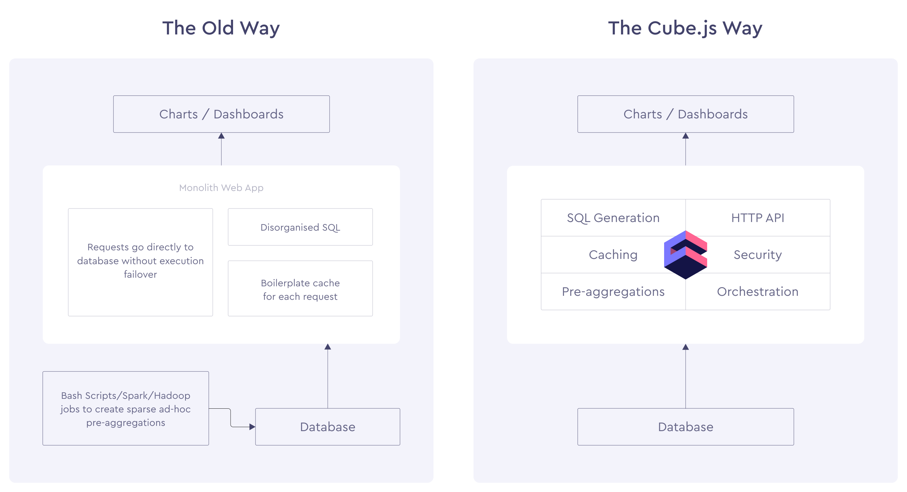

# Cubejs-Sample

This repo consists of the sample works of Cubejs framework for learning

**Frontend** Consists of the frontend work which is done in Reactjs.

**First Project** Consists of the backend work.

**DB** Used is **Postgres Sql**

---

### Cube.js is an open source modular framework to build analytical web applications. It is primarily used to build internal business intelligence tools or to add customer-facing analytics to an existing application.

Cube.js has necessary infrastructure for every analytic application that heavily relies on its caching and pre-aggregation layer to provide several minutes raw data to insight delay and sub second API response times on a trillion of data points scale.

## Architecture

## Cubejs Query Formats

* Measures - It gives the measuare like count of the dimensions.
* Dimensions - They are the queriable attributes.

# Application built 
* Buit a dynamic dashboard using cubejs
* Columns in the database becomes the attributes for the graph
* Cubejs builds the schema automatically.
* Extracted the dimension,measures,filters,timedimesion
* User can choose the charts they want, dimenions, measures, filters, timedimesions

